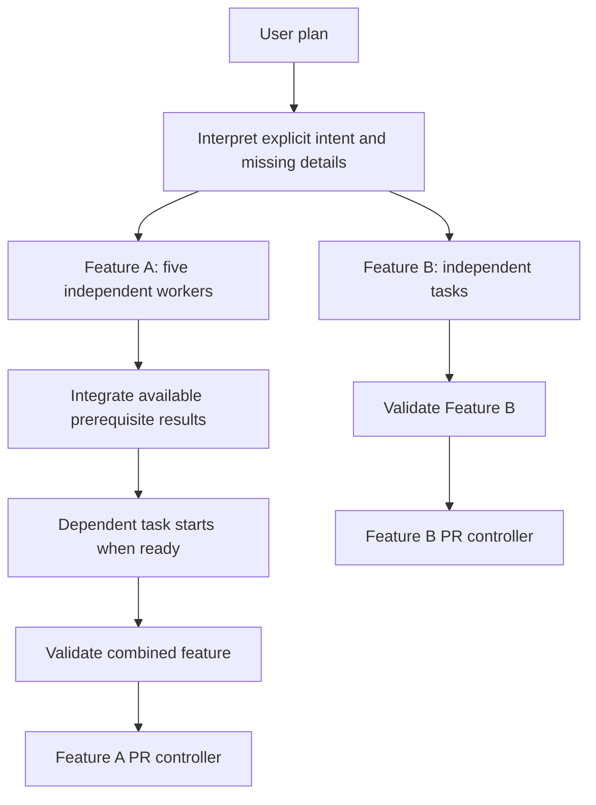

# Plan-Driven Orchestration - Plan

## Goal Capsule

- **Objective:** A user can point `/orchestrate` at a plan and have its parallel tasks and multiple features progress together without manually managing workers or losing track of completion.
- **Means:** Interpret plans into durable, dependency-driven work over the existing subagent runtime; separate execution guarantees from development-workflow presets.
- **Product authority:** This Product Contract records the user-confirmed scope for plan-driven orchestration, including concurrent features and subtasks as one scheduling outcome.
- **Open blockers:** None at the requirements level; implementation choices are classified below.

---

## Product Contract

### Summary

Make `/orchestrate` a plan-driven coordinator that honors explicit execution instructions and infers safe missing details.
Keep the existing feature-delivery workflow available as a preset while supporting concurrent work, controlled adaptation, integration, and recovery.

### Problem Frame

The user's concrete failure case is a plan that asks for five parallel workers but encounters orchestration rules that dictate a different execution shape.
The same friction applies to multiple features and concurrent subtasks: the user wants to describe the work naturally rather than manually manage agent launches or reshape every plan to fit the tool.

### Key Decisions

- **Plan authority with bounded inference.** Governs R1–R4. (session-settled: user-directed — chosen over exhaustive execution specifications or freely rewriting plans: fill missing details without overriding explicit intent.)
- **Dependency-driven execution over a fixed chain.** Governs R5–R8 and R15. (session-settled: user-approved — chosen over parallel-batch patches or conversation-only scripting: concurrency and recovery must work together.)
- **Strict execution guarantees, configurable methodology.** Governs R9–R11 and R16. (session-settled: user-approved — chosen over a mandatory TDD-to-PR recipe: preserve safety without prescribing every development step.)
- **Integrate before declaring delivery.** Governs R12–R14. Worker success alone is insufficient evidence that the combined feature works.
- **Extend rather than replace the underlying runtimes.** Reuse `pi-subagents` for child execution and retain the PR lifecycle controller for publication/review ownership; avoid a second competing agent or PR runtime.

### Actors

- A1. User: supplies plans, authorizes scope and delivery, and intervenes when necessary.
- A2. Coordinator: interprets intent, schedules work, tracks evidence, and routes decisions to A1.
- A3. Workers: execute bounded tasks and return results from their assigned workspaces.
- A4. PR lifecycle controller: owns review and landing after an acknowledged delivery handoff.

### Requirements

**Plan input and authority**

- R1. Accept a path to an ordinary Markdown plan without requiring a particular numbered-task heading format or a hand-authored execution graph.
- R2. Preserve explicit worker counts, parallel groups, dependencies, agent choices, and delivery boundaries unless the user approves a change.
- R3. Infer missing execution details and expose the resulting interpretation, asking only when ambiguity materially affects scope, safety, or delivery.
- R4. When an explicit instruction conflicts with available capacity, capabilities, or safety constraints, explain the conflict rather than silently clamp, substitute, or serialize the requested execution.

**Concurrent scheduling and control**

- R5. Launch ready independent tasks concurrently up to the effective authorized capacity, including five simultaneous workers when the plan requests them and capacity permits.
- R6. Release dependent work when its required results are available in its execution context, without waiting for unrelated tasks in the same batch or feature.
- R7. Allow multiple features to progress together and accept additional features while existing work runs, without resetting existing work.
- R8. Scope task failures, blocks, pauses, and retries to the targeted work and its dependents; unrelated ready work must remain eligible to progress.

**Execution guarantees and adaptation**

- R9. Give concurrent mutation workers isolated workspaces and enforce one active writer per workspace, preserving unrelated user changes.
- R10. Permit necessary subtasks to be added within approved scope while requiring user approval for changes to explicit plan instructions, scope, or delivery boundaries.
- R11. Present identifiable feature/task progress, dependency blockers, inferred decisions, and capacity constraints so the user can understand and target the running work.

**Integration and delivery**

- R12. Combine related worker results through a controlled integration writer and validate the combined result before treating the feature as delivery-ready.
- R13. Default to separate PRs for independent features and one integrated feature PR for its related parallel tasks, honoring explicit plan overrides within authorized delivery policy.
- R14. Preserve PR-controller ownership after acknowledged handoff and require verified merge evidence before marking merge-dependent work complete.

**Recovery and methodology**

- R15. Persist task identities, dependencies, attempts, run references, and integration outcomes so restart or reload reconciles existing work before launching replacements.
- R16. Offer the existing TDD, QA, agent/model selection, and feature-to-PR sequence as a selectable preset rather than mandatory scheduling-engine behavior; safety and authorization remain enforced across presets.

### Key Flows

- F1. Execute a supplied plan.
  - **Trigger:** A1 supplies a plan path to A2.
  - **Steps:** Interpret the plan per R1–R3; surface conflicts per R4; schedule eligible work per R5–R6; expose progress per R11.
  - **Outcome:** A3 workers follow the plan's execution intent without requiring the user to manage launches.
- F2. Add or change work during execution.
  - **Trigger:** A1 adds a feature or a worker discovers a necessary subtask.
  - **Steps:** Admit work per R7 or R10; update dependency relationships; apply targeted intervention per R8.
  - **Outcome:** Existing independent work continues while new eligible work joins the schedule.
- F3. Integrate, deliver, and recover.
  - **Trigger:** Worker results become available, or the coordinator restarts.
  - **Steps:** Reconcile recorded runs per R15; integrate and validate per R12; apply delivery grouping per R13; hand off ownership per R14.
  - **Outcome:** Delivery reflects combined evidence rather than a count of successful child runs.

The following example illustrates F1–F3; it does not mandate fixed batch barriers.

### Acceptance Examples

- AE1. Five-worker plan with another feature in flight. **Covers R1, R2, R5, R7, R9, R11.** Given a plain Markdown plan naming five independent mutation tasks for Feature A and authorized capacity for those five plus Feature B, all five A workers overlap in execution while B also progresses; each mutation worker has a distinct workspace and visible identity.
- AE2. Dependency readiness is not a batch barrier. **Covers R6, R12.** Given tasks `alpha` and `beta` supply the only prerequisites for task `follow-up` while three other tasks remain running, `follow-up` starts after the `alpha`/`beta` results are available in its workspace; it does not wait for the other three tasks.
- AE3. One blocked subtask. **Covers R8, R11.** When task `gamma` blocks, its dependents remain blocked with a visible reason while independent tasks in Features A and B continue; retrying `gamma` does not rerun completed siblings.
- AE4. Requested concurrency exceeds capacity. **Covers R2, R4, R11.** Given a plan explicitly requesting five simultaneous workers but only two authorized slots, the coordinator reports the mismatch and obtains approval before treating two-at-a-time execution as an acceptable substitute.
- AE5. Sparse plan and discovered work. **Covers R3, R10.** Given a plan without scheduling details, the coordinator infers a schedule and records it; a necessary in-scope subtask can join that schedule, but changing an explicit dependency or adding a new product feature requires approval.
- AE6. Reload with active workers. **Covers R9, R15.** Given running, completed, and integrated tasks at reload, recovery reconnects or reconciles their recorded outcomes without duplicating active writers or reapplying integrated commits; uncertain outcomes are surfaced rather than assumed absent.
- AE7. Integration failure is not success. **Covers R8, R12–R14.** Given five successful workers whose combined changes conflict or fail validation, Feature A remains not delivery-ready while independent Feature B can proceed through its own PR lifecycle.
- AE8. Targeted control and delivery overrides. **Covers R7, R8, R13, R14.** Pausing Feature A does not pause Feature B; an approved plan-level PR grouping overrides the default, and handoff does not count as merge completion.
- AE9. Legacy methodology remains available. **Covers R16.** Selecting the legacy preset reproduces its TDD/QA delivery sequence, while selecting plan-driven execution does not force that sequence on a valid alternative plan.

### Scope Boundaries

- This work owns plan interpretation and reliable coordination across features and subtasks, including integration and delivery tracking.
- No replacement subagent runtime, unrestricted recursive worker spawning, or replacement PR-review/landing controller.
- No new visual workflow designer or mandatory workflow language; the progress requirement is R11.
- Changing user Git safety rules or granting publication authority through plan content is outside scope.

### Dependencies / Assumptions

- Parallelism is bounded by configured provider/runtime capacity and user authorization, not by a new hard-coded worker count; R4 governs mismatches.
- The planner must verify the installed `pi-subagents` execution, recovery, and isolation interfaces before choosing an adapter.
- The implementation base must use freshly fetched upstream code while preserving the existing dirty checkout; this artifact does not authorize merging or discarding those local edits.

### Sources / Research

Implementation entry points to inspect against the newly fetched upstream revision:

- `src/orchestrate.ts`: `runFeatureChain`, `withChainLock`, spawn policy, worker launch parameters, and feature commands.
- `src/lib/plan-tasks.ts`: task parsing and task-count policy.
- `src/lib/feature-state.ts`: durable feature state and ownership.
- `src/lib/pr-review-controller.ts` and `src/pr-await-latch.ts`: PR ownership and controller handoff.
- `README.md` and `agents/`: local planning and worker contracts; distinguish uncommitted local work from upstream behavior.

---

## Planning Contract

### Baseline and change boundaries

The inspected `origin/main` commit is `9a185f78e9119e7850a04cb1babf76445cab203c`.
The local checkout was 39 commits behind that ref and contained substantial uncommitted changes when inspected.
This is a source-inspection baseline, not permission to start implementation from a stale ref: fetch again, measure divergence, and create the implementation worktree with `git wt` from the fresh default branch.
Carry this plan into that worktree without merging, staging, or overwriting unrelated local work.

The inspected upstream seams are:

| Seam | Observed behavior | Consequence |
|---|---|---|
| `src/orchestrate.ts`, `runFeatureChain` | Selects one task and awaits one child; feature state carries scalar worker fields | Introduce task-attempt state and a ready-work scheduler |
| `src/orchestrate.ts`, `applySpawnPolicy` | Pins named roles/models and clamps writer concurrency | Separate preset defaults from safety and capacity validation |
| `src/orchestrate.ts`, `runChildInPhase` | Holds a session-wide phase allowlist during a child run | Do not compose concurrent feature phases using intersecting session allowlists |
| `src/orchestrate.ts`, `awaitSpawn` | Correlates spawn replies and completion events, including early completion | Retain race coverage; separate launch acknowledgement from terminal observation |
| `src/lib/plan-tasks.ts` | Parses numbered headings and enforces a 12-task cap | Retain as a legacy importer, not the plan-driven representation |
| `src/lib/pr-review-controller.ts` | Owns PR generations and review/fix publication | Use an adapter; do not add another PR driver |

The dirty local task/check/baseline work is not part of that upstream baseline.
In particular, `src/lib/task-contract.ts`, `src/lib/task-check.ts`, and local plan-baseline handling must not become undeclared implementation dependencies.
At implementation start, check whether they have landed; reuse them if present, otherwise implement the small normalized check boundary below without copying unrelated dirty code.

### Runtime findings and compatibility envelope

Inspection of the sibling `pi-subagents` checkout found committed HEAD `42257fc26a6c93ae6062b523e0d86912d4a21276` with additional local modifications.
Treat these findings as capability-design constraints, not proof of the currently loaded runtime:

- `src/extension/rpc.ts` supplies event RPC for detached spawn, status, and control; direct single-child spawn is supported by the public execution normalizer.
- `src/workflows/scripted-workflow.ts`, `runWorkflowScript`, creates a new launch map and semaphore per invocation: workflow keys do not deduplicate launches across separate workflows or restarts.
- Runtime top-level async occupancy and cumulative spawn allowance are separate limits; fleet output is an observation, not a reservation API.
- Durable operation lookup/spawn support appears in dirty local RPC code, not that committed HEAD; an unresolved reservation can remain unknown without a recoverable run ID.
- Capability ceilings are session-wide intersections; runtime controls may reject a different owning session even when it is in the same repository.
- Managed worktree cleanup can remove branches/worktrees, which conflicts with the user's Git policy.

No `pi-subagents` source change is required by this plan.
Negotiate live RPC methods/capabilities and maintain a conservative adapter fallback; missing launch acknowledgement enters recovery-needed rather than assuming a child never started.
The first release promises recovery without duplicate work, not uninterrupted automatic recovery from every unknown launch outcome.

### Key Technical Decisions

- KTD1. **One validated execution manifest, separate from the source plan.** Covers R1–R3, R10, R15. Store immutable source snapshots and normalized manifest revisions under the existing orchestrator state root; preserve user Markdown and never store mutable task progress in it.
- KTD2. **Task attempts own execution; feature groups own presentation; delivery groups own PRs.** Covers R5–R8, R13–R15. A feature is not a scheduling barrier, and a PR need not be the unit of worker isolation.
- KTD3. **One admission loop over a repository's active features.** Covers R5–R8. Use round-robin ready selection with durable reservations, constrained by authorized coordinator capacity and runtime admission; do not launch a separate opaque long-running workflow for each feature.
- KTD4. **A thin single-attempt RPC adapter.** Covers R4, R9, R15. Reuse detached child execution, status artifacts, and controls; keep graph semantics and attempt bookkeeping in this package rather than relying on invocation-local workflow keys.
- KTD5. **Caller-owned worktrees and immutable result receipts.** Covers R6, R9, R12. Provision through `git wt`, bind every task to a recorded base plus prerequisite receipts, and keep worktrees until user-authorized cleanup.
- KTD6. **Explicit safety boundary, no concurrent phase ceilings.** Covers R2, R9, R16. Preserve inherited runtime restrictions while validating each launch profile and owned workspace without temporarily restricting the whole parent session to one feature's phase.
- KTD7. **Versioned additive compatibility.** Covers R15, R16. Leave active legacy chains on their existing driver; import new legacy-preset runs into explicit sequential dependencies and preset check/QA nodes instead of maintaining two permanent new schedulers.

### Proposed data and module seams

All paths and interfaces in the following design are proposed additions unless explicitly described as existing.
Use ordinary TypeScript modules and Node filesystem primitives; do not introduce a workflow framework or database dependency.

- `ExecutionManifest`: schema version, revision, source digest, authorized repo/base, feature groups, delivery groups, tasks, and explicit execution constraints with source anchors; annotate inferred fields separately.
- `TaskSpec`: stable opaque ID, feature, task text, read-only/mutation mode, dependency IDs, agent/model preference, normalized checks, and result/delivery association. Parent/child grouping is presentation, not an implicit dependency.
- `TaskAttempt`: task revision digest, attempt UUID, canonical owner session file, launch digest, optional operation ID, run ID/artifact directory, workspace, base/prerequisite receipts, and lifecycle state.
- `ResultReceipt`: producing attempt, validated output path or committed range, check results, and immutable digest. Dependents consume receipts, not another worker's changing branch.
- `IntegrationReceipt`: target delivery group, ordered input receipts, before/after commit, validation evidence, and ownership transfer acknowledgement where applicable.
- `CoordinatorState`: active manifest revisions, task/attempt records, resource reservations, repository-wide authorized `capacity`, owner/epoch, and monotonic event sequence. Capacity starts at zero until caller authorization is recorded; feature concurrency requests never add to or raise it. Transactions reject reservations exceeding capacity and reject reductions below existing reserved occupancy without changing state or stopping workers. Existing Markdown status and overlays become projections for new runs.

Core injectable interfaces are `AttemptRuntime` (`probe`, `launch`, `observe`, `control`, completion subscription), `WorkspaceAdapter` (`prepare`, `inspect`, `compose`), `CheckExecutor` (`execute`, `validateEvidence`), and `DeliveryAdapter` (`handoff`, `observe`).
Methods return discriminated results such as known-running, known-terminal, rejected-before-start, capacity-deferred, and unknown; text is explanatory, never a completion protocol.
Freeze these interfaces in U1 so five implementation lanes can build against fakes independently.

### Interpretation and revision rules

1. Import the plan with its canonical path, bytes/digest, and source anchors. An existing path is imported, not treated as an objective to rewrite; keep `/orchestrate plan <objective>` for creating a plan.
2. A configured interpretation agent returns schema-validated manifest data and unresolved decisions. Never evaluate JavaScript or shell instructions embedded in the plan as orchestration code.
3. Validate unique IDs, existing references, acyclicity, execution capabilities, repository/workspace ownership, group consistency, and check argument shapes before approval. Explicit concurrency conflicts are visible admission decisions, not silent coercions.
4. Show the compact interpretation with explicit versus inferred choices through the existing approval surface. Approval binds the source digest and manifest revision; source changes invalidate only affected not-yet-started work, not completed receipts.
5. In-scope discovered subtasks are proposed as a manifest revision, then mechanically checked against the approved scope and explicit constraints. Uncertain scope or changed explicit instructions require user approval; running attempts keep immutable contracts and affected pending dependents wait for the revision decision.
6. Checks use normalized `{cwd, argv, runner, expectedEvidence}` records, never prose interpolation into a shell. U3 owns `CheckExecutor` and the native Node, Vitest, and Cargo report validators; U4 worker receipts and U6 delivery gates consume that same interface. Require fresh reports, positive executed-test counts, and execution of every required selected test; an unrelated skipped test does not fail an otherwise valid suite. Missing/stale reports, zero/all-skipped selections, missing required tests, and contradictory exit/report results cannot pass. Non-test commands require an explicit rationale. Reuse landed local-contract work only after the baseline check above.

### Profile precedence and retained authority

Resolve execution preferences in this order: explicit approved plan choice, runtime-resolved agent/profile settings, then selected preset fallback.
Do not send fallback fields that override an agent's own configured behavior.
The existing forced fresh context, literal tool list, supervisor/intercom disablement, model/thinking pins, and turn/timeout defaults become legacy-preset fallbacks, not universal plan-driven policy.
For runners that cannot support a requested override, report the capability conflict per R4 rather than translate it into a different contract.

Inherited tool/agent capability ceilings, user-configured hard budget/resource limits, workspace ownership, forbidden Git operations, and publication/controller authority remain non-overridable restrictions.
A plan cannot enable nested orchestrators or grant tools beyond the caller's ceiling; allowed context, supervisor communication, and profile tool choices survive within that boundary.
The launch validator checks the resolved profile against those restrictions without mutating preferences to disguise a conflict.
Apply this at every orchestrator-owned launch site, including legacy workers/QA and controller fixer launch adapters; remove their session-wide phase registrations while preserving their sequencing and external inherited restrictions.
Already-running children retain their original contracts, and reload disposes only registrations owned by the old orchestrator instance.

### Scheduling, ownership, and recovery

- Put a repository coordinator lease and durable state beside the existing repository feature records, keyed by canonical Git common-directory identity so worktrees of the same repository do not create separate pools.
- Use short locked state transactions with atomic replacement and durable writes; release the transaction lock before RPC or Git work. Keep child lifetime ownership in durable reservations, not in a held JavaScript mutex. U1 uses exclusive-create transaction locks with bounded acquisition; an abandoned or incomplete transaction lock reports recovery-needed and requires explicit manual resolution rather than unsafe automatic lock stealing. Preserve owner diagnostics, state, and reservations while blocked; coordinator-lease recovery remains separate from transaction-lock recovery.
- A coordinator owner includes PID/start identity, canonical session file, coordinator-instance UUID, and epoch. Clean shutdown/reload quiesces admission, invalidates the old epoch, and atomically relinquishes or transfers the coordinator lease without releasing child/workspace reservations. This permits same-PID reload to acquire a new epoch; late callbacks from the previous instance cannot mutate current state. Reclaim an uncooperative owner's lease only after proven owner death, never on heartbeat expiry alone.
- A second live session can record authorized plan/control intents for the owner to consume, but cannot start a competing pool. Poll only locally persisted intents in code when no event route exists; no model-driven wait loop or cross-session capability override.
- Task lifecycle: pending/dependency-blocked, ready, preparing, launching, running, validating, succeeded; orthogonal pause/cancel intent plus failed and recovery-needed outcomes. A delivery group becomes ready only from its required validated receipts.
- Reserve ready work and its workspace before provisioning/launch, counting preparing, launching, running, stopping, and unresolved attempts against occupancy until safely released. Reserve coordinator capacity for an explicit parallel group as a unit; ordinary ready tasks use round-robin feature fairness.
- Runtime admission remains per attempt, not atomic for a group. Persist the group launch set and each accepted/rejected/unknown outcome. If external capacity changes or a launch fails midway, preserve already-started and unknown attempts, mark the group instruction unmet, and surface the conflict; do not quietly queue the missing member after siblings finish. User approval is required before accepting degraded execution or rerunning completed members; unrelated work remains eligible within remaining capacity.
- Runtime preflight rejection is not a task failure. Capacity deferral waits for an event or bounded code-level recheck; budget exhaustion requires user action and must not trigger automatic grants or a tight retry loop.
- Register completion observation before spawn, persist launch intent before RPC, and persist run ID/artifact location immediately after acknowledgement. Optional durable operation lookup is used only if advertised; unknown lookup never proves nonlaunch.
- Treat completion events as wakeups to reconcile exact run evidence. Accept no success from transport acknowledgement, missing fleet entries, missing handoff files, or arbitrary HEAD movement.
- For a known run, use the supported status interface plus a version-checked artifact decoder within the runtime adapter, extending the existing `readRunSnapshot` pattern. Malformed, unavailable, or incompatible evidence yields recovery-needed; do not parse human status prose.
- Reload the same owning session to regain supported controls. A different session may observe recorded evidence but must not spoof runtime ownership; if control/adoption is unsupported, keep the attempt reserved and explain how to resume the owner or resolve it safely.
- A stop acknowledgement means stopping, not stopped. Wait for terminal/process evidence before releasing a workspace or retrying; preserve dirty output as a recovery checkpoint.
- Graceful pause stops admitting targeted work and allows existing attempts to settle. Immediate pause requests targeted runtime stops. Neither cancels unrelated features, and failed dependencies do not poison unrelated nodes.
- On extension shutdown, use the clean coordinator relinquishment protocol without killing child workers or the PR controller. On startup and explicit commands, reconcile owned records before admitting new work; unresolved external operations remain fenced across the instance transition.

### Workspace composition and delivery

- Fetch and record the initial authorized remote base. Provision task worktrees with `git wt <branch> --base <recorded-commit>`; the installed helper advertises `[base-ref]` and `--base REF`, so no raw worktree command is needed.
- A task with code dependencies receives a clean composition of only its required validated prerequisite receipts and their ancestors. Do not use the latest shared feature branch, which may include unrelated work, and do not wait for unrelated siblings.
- Key reusable compositions by base plus ordered receipt digests. Serialize composition writers and use recorded commit ancestry/order to avoid applying a common ancestor twice.
- Record an integration intent before Git mutation, then record the resulting commit/validation receipt. On restart inspect ancestry and any in-progress Git operation before continuing; never blindly replay a merge/cherry-pick or run destructive abort/reset/cleanup commands.
- Freeze the worker's result commit/range after terminal evidence, verify its base, expected scope, and checks, then make it eligible for downstream composition. A clean merge is not proof of behavioral compatibility.
- For final delivery, integrate all required receipts into a dedicated delivery worktree and run the combined gates. Conflicts or validation failures create targeted remediation work; unresolved product choices escalate instead of being guessed.
- Existing per-PR controller ownership applies to the delivery group. Map default groups to existing feature-owner records; represent approved non-default grouping with a stable delivery-owner mapping rather than duplicating a PR obligation.
- Before calling the controller, persist `handoff-pending` with stable PR, owner/generation, worktree, and head identity and fence scheduler mutation of that delivery. If acknowledgement is lost, reconcile the controller's stored obligation before retrying or restoring local ownership; unknown transfer status keeps the fence in place. Once accepted, persist the acknowledgement and observe only. New work against that delivery waits for an authorized ownership transition or a new delivery group; the scheduler never races controller fixes.

### Rollout and user surface

- Add `/orchestrate run <plan-path>` and accept an unambiguous existing Markdown path as shorthand. Use a quoted-argument parser so paths with spaces work; retain the explicit `plan` verb for objectives.
- Extend status and targeted pause/resume/retry to identify feature/task IDs without relying on a global current-feature pointer. Avoid inventing a separate dashboard; extend `src/lib/overlay.ts` and the existing command output.
- New imported plans use plan-driven execution. Existing active records without a schema/engine version stay on the legacy driver; do not hot-migrate in-flight workers or controller-owned PRs.
- New `legacy` preset runs compile the prior order and gates into manifest dependencies. Legacy model defaults are defaults in this preset, not global rewrites of explicit plan choices.
- Defer removal of the old driver until existing runs drain and compatibility tests pass. Rollback means stopping new admissions and resuming the matching engine from its records, not resetting branches or discarding state.

---

## Implementation Units

### U1. Freeze contracts and durable state

- **Depends on:** none.
- **Files:** new `src/lib/execution-contract.ts`, `src/lib/execution-store.ts`, `test/execution-contract.test.ts`, `test/execution-store.test.ts`, and shared test fakes under `test/fixtures/execution/`.
- **Work:** Define the manifest, receipts, runtime/workspace/check/delivery interfaces, pure transition validation, schema versions, canonical repo identity, coordinator instance/lease, epochs, and atomic state writes. Publish frozen fake adapters for the next five lanes.
- **Tests:** Duplicate IDs/cycles/missing refs, stable task identity across revisions, stale owner callbacks, two-process lease contention, same-PID clean reload with late callbacks, incomplete writes, recovery-needed reservations, and unknown-version refusal.
- **Exit:** Contracts and persistence tests pass; no production dispatch changes.

### U2. Implement plan import and presets

- **Depends on:** U1.
- **Files:** new `src/lib/plan-import.ts`, `src/lib/execution-presets.ts`, `test/plan-import.test.ts`, `test/execution-presets.test.ts`, and dedicated plan fixtures.
- **Work:** Implement source snapshots, interpretation schema, explicit/inferred provenance, revision validation, check normalization, plain-Markdown import, and legacy sequential compilation. Inject the interpretation agent transport rather than modify command/runtime wiring here.
- **Tests:** Five-worker Markdown, multiple features, sparse instructions, explicit override conflicts, more than 12 valid tasks, source changes, in-scope subtask addition, unsafe check input, and no arbitrary plan-code execution.
- **Exit:** Manifest output matches the approved interpretation fixtures; no required new input DSL.

### U3. Implement runtime and policy adapter

- **Depends on:** U1.
- **Files:** new `src/lib/attempt-runtime.ts`, `src/lib/execution-policy.ts`, `src/lib/execution-checks.ts`, `test/attempt-runtime.test.ts`, `test/execution-policy.test.ts`, `test/execution-checks.test.ts`, and lane-owned runner report fixtures.
- **Work:** Implement event-RPC launch/observation/control, versioned status decoding, and the shared native check executor/report validators. Apply the profile precedence rule, preserve inherited ceilings, record early events, negotiate optional durable lookup, and classify unknown outcomes conservatively.
- **Tests:** Completion before acknowledgement, duplicate/late events, lost RPC reply, definitive rejection versus capacity deferral, unknown lookup, foreign-session control, stop-before-terminal, and concurrent planner/worker launches without intersecting phase ceilings. Check tests cover zero/all-skipped selections, missing/stale reports, missing required tests, unrelated skips, exit/report disagreement, and fresh Node/Vitest/Cargo evidence. Profile tests preserve allowed non-default context/tools/supervisor settings while refusing a wider caller permission set.
- **Exit:** Adapter contract suite passes against committed-capability and optional-capability fixtures; no import of runtime private executor/worktree modules.

### U4. Implement owned task workspaces

- **Depends on:** U1.
- **Files:** new `src/lib/task-workspaces.ts`, `test/task-workspaces.test.ts`, and lane-specific temporary-repo fixtures.
- **Work:** Implement Git-helper provisioning, ownership reservations, pinned bases, prerequisite-only composition, immutable worker receipts, and non-destructive recovery. Inject Git execution and receipt/state adapters.
- **Tests:** Five distinct workspaces, dirty reference preservation, shared-ancestor composition, wrong-base/scope refusal, a dependent task excluding unrelated sibling commits, and crash with an unfinished composition.
- **Exit:** Fixture tests prove one writer per workspace and no prohibited Git operations or automatic cleanup.

### U5. Implement ready-work scheduling

- **Depends on:** U1.
- **Files:** new `src/lib/execution-scheduler.ts`, `test/execution-scheduler.test.ts`.
- **Work:** Implement event-driven admission, task-local blocking/control, round-robin feature fairness, explicit parallel-group reservations, revision intents, and startup reconciliation using only the frozen fake adapters initially.
- **Tests:** Five overlapping workers plus Feature B with six authorized slots, prerequisite-only readiness, add-feature while busy, bounded capacity, capacity loss between group preflight and its fifth launch, no silent serialization after partial group admission, no busy retry on budget rejection, concurrent reconcile triggers, and unknown-attempt occupancy retention.
- **Exit:** Pure/fake-runtime tests pass under reordered events and repeated reconciliation.

### U6. Implement integration and delivery adapter

- **Depends on:** U1.
- **Files:** new `src/lib/execution-delivery.ts`, `test/execution-delivery.test.ts`.
- **Work:** Implement final composition/check orchestration, integration receipts, targeted remediation proposals, delivery-group mapping, and acknowledged handoff to an injected existing controller interface. Use U1 workspace/runtime fakes rather than depend on U3/U4 implementations while coding.
- **Tests:** Worker success with combined failure, conflict remediation, crash after Git mutation before receipt, shared PR grouping, duplicate handoff, crash after controller persistence before local acknowledgement, pending-transfer mutation fences, controller ownership preventing scheduler writes, and merged versus closed-unmerged completion.
- **Exit:** Delivery contract tests pass; the existing controller state machine is unchanged.

### U7. Wire command, lifecycle, and compatibility

- **Depends on:** U2, U3, U4, U5, U6.
- **Files:** existing `src/orchestrate.ts`, `src/lib/feature-state.ts`, `src/lib/overlay.ts`, `src/lib/lifecycle.ts`, `src/git-workflow-guard.ts`, `src/lib/git-workflow-guard.ts`, relevant existing tests, `README.md`, `src/orchestrate.json`, and discovered role templates where required.
- **Work:** Connect the five lanes under the repository coordinator, including the shared check executor; introduce the plan-path command/approval surface, route versioned state to the correct engine, remove orchestrator-owned session-wide phase ceilings at all new, legacy, and controller launch sites, and apply profile precedence without changing legacy sequencing. Extend role-aware ownership guards to configured workers and project progress without competing status writers. Preserve legacy execution records and PR-controller ownership until drained.
- **Tests:** Real extension registration with fake runtime, quoted paths, approval revision binding, legacy/current mixed records, legacy-QA/new-worker and controller-fixer/new-planner overlap, targeted controls, same-PID reload lifecycle, configurable agents under inherited restrictions, and controller ownership regression suites.
- **Exit:** Full package check passes; read-only import/status and fake-runtime execution work through the user command.

### U8. Prove the end-to-end acceptance cases

- **Depends on:** U7.
- **Files:** new `test/execution-e2e.test.ts`, `test/fixtures/execution/five-workers.md`, `test/fixtures/execution/fake-child.mjs`, and a concise manual QA recipe in `qa/`.
- **Work:** Exercise the actual command, scheduler, adapters, and persisted state using disposable repositories and controllable subprocess workers. Add bounded live-runtime verification only after deterministic gates pass.
- **Tests:** All AE1–AE9, process termination at each launch/integration boundary, owner-session reload, loss/reordering of notifications, and no duplicate launch or mutation after controller handoff.
- **Exit:** Capture worker start/end intervals proving overlap, workspace identities, combined check receipts, and before/after recovery state. A live PR/merge probe requires separately authorized publication; deterministic controller fixtures remain mandatory.

### Parallel implementation schedule

U1 establishes the shared interfaces first.
Then **spawn five parallel workers for U2, U3, U4, U5, and U6**, each in its own `git wt` worktree with exclusive ownership of the files listed for that unit.
These lanes depend on U1's contracts, not on unfinished sibling implementations; each tests against fakes.
If a contract must change, report it to the parent and pause only affected lanes until a reviewed contract revision is supplied.

One integration writer combines those five lanes and executes U7, then U8 validates the combined result.
Do not let the five workers edit `src/orchestrate.ts`, shared contracts, shared fixtures, or each other's files.
Use fresh upstream bases plus the committed U1 result, preserve every lane's commits, and revalidate after integration.
If actual authorized capacity is below five, surface that before execution rather than silently changing this schedule.

---

## Verification Contract

The following commands are intended implementation gates, not claims that implementation tests already exist or have passed.
Run them from the fresh implementation worktree, never use the dirty reference checkout as the baseline test target.

| Gate | Command or evidence | Coverage |
|---|---|---|
| Baseline | `rtk npm run check` before edits; record failures separately | Existing behavior and dependency setup |
| Contract/store | `rtk proxy node --experimental-strip-types --test test/execution-contract.test.ts test/execution-store.test.ts` | U1 |
| Import/presets | `rtk proxy node --experimental-strip-types --test test/plan-import.test.ts test/execution-presets.test.ts` | U2; R1–R4, R10, R16 |
| Runtime/policy/checks | `rtk proxy node --experimental-strip-types --test test/attempt-runtime.test.ts test/execution-policy.test.ts test/execution-checks.test.ts` | U3; R2, R4, R9, R12, R15, R16 |
| Workspaces | `rtk proxy node --experimental-strip-types --test test/task-workspaces.test.ts` | U4; R6, R9, R12 |
| Scheduler | `rtk proxy node --experimental-strip-types --test test/execution-scheduler.test.ts` | U5; R5–R8, R10, R15 |
| Delivery | `rtk proxy node --experimental-strip-types --test test/execution-delivery.test.ts` | U6; R12–R14 |
| End-to-end | `rtk proxy node --experimental-strip-types --test test/execution-e2e.test.ts` | U7–U8; AE1–AE9 |
| Full regression | `rtk npm run check` and `rtk git diff --check` | All units; existing latch/controller/guard tests |
| Actual overlap | Timestamped start/end records show five A workers active concurrently while B advances with capacity six | AE1; count alone is insufficient |
| Recovery | Terminate/restart at launch-intent, acknowledged-launch, commit, receipt, and controller-handoff boundaries; also reload in the same PID with a late callback | AE6–AE7; lease and transfer fences |
| Live runtime | Isolated Pi configuration loading the candidate extension plus the supported runtime, disposable repo, authorized six-slot capacity, no PR publication | Adapter compatibility and user-facing command flow |

For real Git fixture tests, create fresh disposable repositories and preserve them on failure; do not use forbidden reset/restore/checkout/cleanup commands in test setup or teardown.
Property tests should generate acyclic dependency graphs and event permutations, asserting no task consumes missing prerequisites, no task owns two live attempts, no workspace has two writers, and reservations never exceed authorized admission.

---

## Definition of Done

- Every R1–R16 has passing deterministic coverage, and AE1–AE9 pass through the integrated implementation rather than only helper mocks.
- The five-worker demonstration records actual overlap and concurrent progress of a second feature, with distinct workspaces and correct prerequisite composition.
- Failure injection proves duplicate-safe recovery; unknown launch/integration outcomes remain explicit and cannot trigger blind replay.
- New plan-driven work and existing legacy/controller-owned work coexist without shared-session ceiling interference or competing writers.
- Combined validation gates pass after integrating all implementation lanes, and fresh-context review has no unresolved blocking findings.
- Existing user work is untouched; no source was copied into live auto-load directories, no configuration or capacity was silently raised, and no prohibited Git operation ran.
- If implementation is subsequently authorized for publication, the owner performs one controller handoff; merge-dependent completion is reported only after verified merge evidence.

---

## Implementation Progress

Updated during implementation at the user's request. A unit is checked off only after its tests and review gate pass.

| Unit | Progress | Evidence |
|---|---|---|
| Baseline | Complete | Fresh upstream `9a185f7`; typecheck and 504 tests pass after correcting an obsolete skill-text assertion in the isolated worktree |
| U1 | Complete | Commits `8c272b8`, `04480ae`; four review regressions red→green; typecheck and 533 tests pass; independent recheck READY |
| U2 | Complete | Commits `10ffa40`, `b460efd`; attached interpreter-option regressions pass; parent full check passes; independent recheck READY |
| U3 | Complete | Commits `346fd320`, `6236c03`; contradictory/cancelled Node evidence rejected; parent full check passes; independent recheck READY |
| U4 | Complete | Commits `dc5f340`, `3cb030c`; raw paths/artifact freshness/allowed branch query verified; parent 15 targeted tests/full check pass; independent recheck READY |
| U5 | Complete | Commits `a7b7892`, `0b69c44`; four original race repros fixed; parent full check passes; independent recheck READY |
| U6 | Complete | Commits `040475a`, `69c7788`; canonical PR identities and exact pre-handoff composition verified; parent 20 targeted tests/full check pass; independent recheck READY |
| U7 | In progress | All five reviewed lanes integrated at `742b984`; combined package check passes; wiring command/lifecycle/production ports and central ownership guard |
| U8 | Pending | Waits for integrated implementation |

### Active lane ownership

All five lanes start from reviewed U1 commit `04480ae`, with no missing upstream commits at launch. Their shared contracts and fixtures are read-only; any necessary contract revision returns to the parent. Workers validate and commit only their claimed files, without pushing, opening PRs, or cleaning up worktrees.

| Lane | Isolated workspace, relative to reference repo | Exclusive claim | Next gate |
|---|---|---|---|
| U2 | `../pi-orchestrate-wt/feat-plan-driven-u2-import` | Plan import/preset modules, their tests and dedicated import fixtures | Targeted tests, full check, fresh review |
| U3 | `../pi-orchestrate-wt/feat-plan-driven-u3-runtime` | Runtime/policy/check modules, their tests and dedicated report fixtures | Targeted tests, full check, fresh review |
| U4 | `../pi-orchestrate-wt/feat-plan-driven-u4-workspaces` | Task-workspace module, its tests and dedicated workspace fixtures | Targeted tests, full check, fresh review |
| U5 | `../pi-orchestrate-wt/feat-plan-driven-u5-scheduler` | Execution-scheduler module and its tests | Targeted tests, full check, fresh review |
| U6 | `../pi-orchestrate-wt/feat-plan-driven-u6-delivery` | Execution-delivery module and its tests | Targeted tests, full check, fresh review |

Parent integration workspace: `../pi-orchestrate-wt/feat-plan-driven-orchestration`. Parent owns Markdown progress, shared-contract changes, integration, and U7 wiring.
